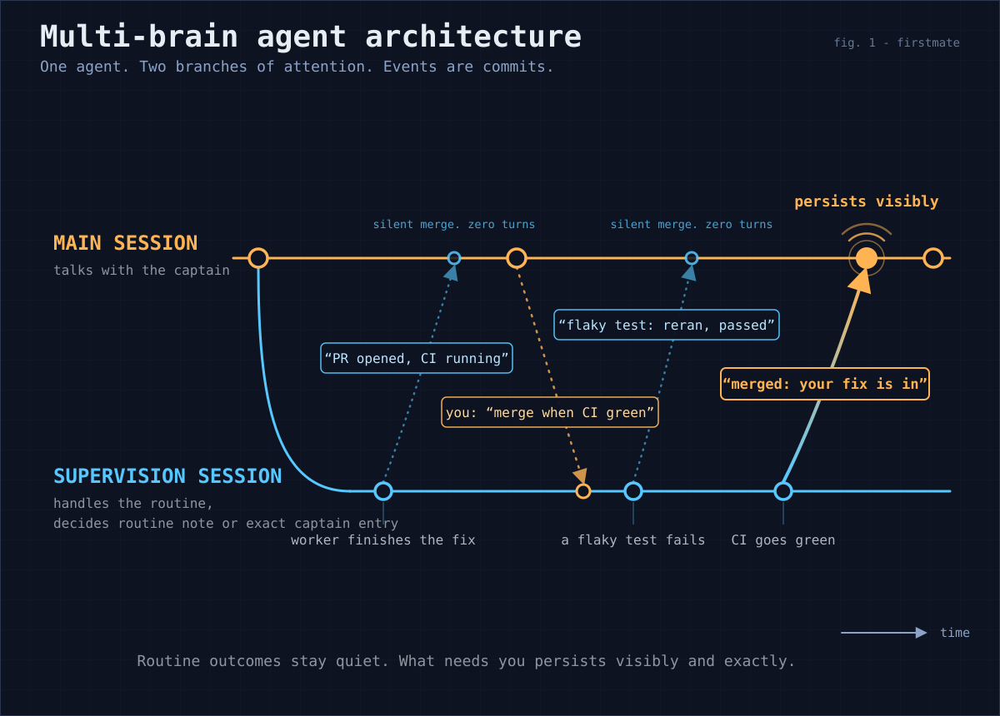

# Pi supervision branch

This document covers the supervision branch that runs fleet supervision beside the captain's chat on a Pi primary.
Maintainers changing how wakes reach the branch, how its outcomes reach the captain, or how the attended and away postures differ need it.

The poster is the visual of the idea.
This document stays the owner and the contract.

## Find a topic

| What you want to know | Start here |
| --- | --- |
| What the branch handles and what stays on main | [Overview](#overview) |
| Which file owns each part of the design | [Components and their owners](#components-and-their-owners) |
| Why delivery never freezes the captain's terminal | [Off-thread delivery](#off-thread-delivery) |
| How a captain-facing event whose wake was lost still surfaces | [Lost-wake outcome backstop](#lost-wake-outcome-backstop) |
| What the branch sees of the captain's conversation | [How the branch knows what the captain said](#how-the-branch-knows-what-the-captain-said) |
| How outcomes are classified, shown, and acknowledged | [Two-stage noise filter](#two-stage-noise-filter) |
| How fleet-wide heartbeat reviews are routed | [Heartbeat routing](#heartbeat-routing) |
| Prompt caching and the branch model | [Cost model and the byte-stable prefix](#cost-model-and-the-byte-stable-prefix) |
| What changes while the captain is away | [Postures](#postures) |
| Which tests pin this contract | [Verification](#verification) |

## Overview

Fleet supervision on the Pi primary harness runs on a second conversation - the supervision branch - inside the same `pi` process as the captain's chat.

### What the branch handles while attended

Supervision is default-on.
Once a Pi primary session owns this home's fleet lock, the branch handles two kinds of work:

- Eligible task-local rows from ordinary actionable wakes.
  A row is one queued wake entry.
- Heartbeat scans that the cheap bash-level scan flags as possibly captain-relevant.

The branch then merges each outcome back into the captain conversation's transcript.

Some wakes stay on main:

- Ordinary main-only rows remain on main even when eligible task-local rows share their queue.
- A decision-owned signal or stale trigger keeps its entire coalesced trigger batch on main.
- An unresolvable row makes the scan unsafe and returns the whole wake to main.
- Every watcher-failure alarm also stays on main.

All of that describes the attended posture.
The away posture, recorded by `state/.afk-contract`, hands every row to the branch and parks main (see "Postures" below).

### How outcomes reach main

While attended, captain-relevant branch outcomes persist as exact, sequence-keyed visible transcript entries.
They then open one sequence-keyed processing turn on main, which stays open until main acknowledges that sequence.
While away, the entries persist but processing waits until the record is archived.

### Design source

The design source is the captain-approved forked-supervision architecture board.
That board is a captain-private fleet record: a self-contained HTML explainer with the measured cache and judgment evidence.
This document records the shape it landed as, and the delivering PR cites the board artifact itself.

### Pi-only scope

This in-process supervision branch is Pi-only by construction:

- The branch lives in `.pi/extensions/fm-branch-supervision.ts`, which only a Pi primary ever loads.
  No other harness gains branch supervision behavior.
- In a home with no branch state, the bash-side additions remain inert (`tests/fm-branch-supervision.test.sh`).
  `bin/fm-lease-lib.sh` owns how a pre-existing lease is honored on any harness.
  A home on any harness that already has an outcome store still receives the shared drain compatibility recovery described in [Lost-wake outcome backstop](#lost-wake-outcome-backstop).
- It does not change which harness is primary and never moves a home to Pi.

On an opted-in non-Pi home, the supervision host runs the away branch beside the primary.
[supervision-host.md](supervision-host.md) owns its scope and mechanism.

## Components and their owners

| Component | Owner or rule |
| --- | --- |
| [Wake dispatch](#wake-dispatch) | `.pi/extensions/fm-primary-pi-watch.ts` dispatches; `.pi/extensions/lib/fm-branch-dispatch.ts` owns the offer handshake and row eligibility |
| [The branch itself](#the-branch-itself) | `.pi/extensions/fm-branch-supervision.ts` |
| [Branch model and effort selection](#branch-model-and-effort-selection) | `/supervision-model`, registered by the same extension |
| [Branch system prompt](#branch-system-prompt) | `bin/fm-branch-prompt.sh` |
| [Outcome store](#outcome-store) | `bin/fm-branch-outcome.sh` |
| [Consistency](#consistency) | `bin/fm-lease-lib.sh`, with `bin/fm-lease.sh` as the command surface |
| [Autonomy](#autonomy) | Default-on once a Pi primary session owns the fleet lock |

### Wake dispatch

`.pi/extensions/fm-primary-pi-watch.ts` stays the dispatcher.
`.pi/extensions/lib/fm-branch-dispatch.ts` owns the offer handshake and row eligibility.
[`watcher-continuity.md`](watcher-continuity.md#per-actor-acknowledgement) owns the per-actor consume contract.

A successful row grant transfers ownership of exactly the currently branch-eligible rows to the branch.

What is never offered, or falls back to main:

- While attended, a check-kind triggering close is never offered, even when other rows are eligible.
  Check-kind closes are merge-confirmation polls, Relay mentions, credential/auth failures, and every other legitimately main-only class.
- When a triggering close has no acceptor (extension absent, branch broken), it keeps today's wake-to-main path.
- Watcher-failure alarms always go to main, because only main can repair the watcher cycle.

Under the away-posture record, the check-kind and decision-owned exclusions lift and every actionable row is offered ("Postures" below).
The no-acceptor fallback and the alarms still reach main in that posture.

#### Decision-owned rows

A decision-owned event surfaced by `bin/fm-watch.sh`'s signal path gets the same treatment as a check-kind triggering close, even though it keeps the ordinary `signal` kind.
`signal_files_actionable` marks the queued payload `needs-decision:` for any of these:

- A newly surfaced `needs-decision`.
- A `captain-held` declaration surfaced through the no-verb fallback.
- A pending-reply second-mate escalation.

`scopeForUnreadWake` excludes every marked row from what the branch may claim.

For a stale row, `scopeForUnreadWake` folds the mapped task's status log.
It excludes the row when any `needs-decision` remains open or the current meaningful declaration is `captain-held`.
An unreadable or symlinked status log fails the scope closed rather than influencing routing.

Before cross-referencing them, the dispatcher resolves trigger keys and every currently unread excluded decision row to task identity.
The cross-reference then applies two rules:

- Any signal or stale trigger containing a decision-owned task goes wholly to main, including a batch that also contains routine rows.
- An unread decision for one task keeps every later signal or stale trigger for that same task on main until the decision row is read.
  This holds regardless of whether the rows use its status-file key or window alias.

Other tasks remain independently eligible.
The wake message itself retains its existing shape, so other harness-arm scripts remain unchanged.

#### Heartbeats during dispatch

Heartbeat handling remains independent.
A fleet-wide heartbeat keeps its own all-or-nothing rule (see "Heartbeat routing" below): it takes every branch-ownable unread row or none of them.
A co-present main-owned check row no longer defers that review to main.
That row is not fleet context the branch is missing, and main is woken for it on its own triggering close.

### The branch itself

`.pi/extensions/fm-branch-supervision.ts` creates the branch session, serializes wakes, mirrors dialog, and merges outcomes.

#### One conversation per main session

The branch conversation lasts for exactly one main session.
Every main session start - a cold start, `/new`, `/resume`, `/fork`, or a reload - opens a NEW branch conversation.
A conversation recorded by an earlier session is never reopened as the live one.
That keeps the branch reasoning from the current generated prompt and the current main dialog rather than from weeks of accumulated thread, where a superseded rule could still outweigh today's.

A model or effort change triggers a rebuild inside one main session.
Only such a rebuild continues that session's own conversation, and `state/.branch-session` records it.

Earlier conversations stay on disk under `state/branch-session/`, exactly as Pi keeps its own session files.
They are never reopened as live branch context.
The effort picker may only inspect the model named by the current pointer, as the last-resort lookup documented in [configuration.md](configuration.md#pi-supervision-branch-model-and-effort-configsupervision-branch-model-configsupervision-branch-effort).

Nothing captain-facing rides on that conversation.
The durable outcome store and its processed marker are what carry unacknowledged outcomes across the boundary.
They re-present on the new main session exactly as they do after a crash.

#### Guarded side effects and delivery ownership

Before each guarded branch side effect, the extension checks the current extension generation and `state/.lock` ownership.
That way, replacement or lock loss cannot let an old continuation mutate the new session.
Those checks and the store calls around them are awaited rather than synchronous.
An explicit queue inside the extension is what keeps them serialized (see "Off-thread delivery" below).

Every accepted path that cannot reach a working branch rejects its settlement to the watcher.
The watcher retains delivery ownership and routes the wake to main as a follow-up, which counts as delivered once Pi accepts it.
A broken branch declines later offers, so they take that path directly.

After wake rows are claimed, a branch prompt counts as handled only when `fm_branch_report` appends a durable outcome before that prompt settles.
A settled provider error, or a settled prompt with no report, releases the grant and rejects delivery ownership back to the watcher.

#### Report scoping

While a signal or stale prompt is open, `fm_branch_report` accepts only the tasks that prompt's claimed rows resolve to:

- A signal row resolves by its status-log key.
- A stale row resolves through the task record naming that endpoint.

A report for any other task id, `fleet` included, is refused before the store is touched.
That way, a task remembered from an earlier wake cannot become a delivered outcome.
A heartbeat review is not scoped by task.

The branch's guarded commands never tell it to drain queued rows mid-handling.
For that actor, `bin/fm-guard.sh` keeps the queued-wakes warning silent.
An acknowledgement that consumed nothing reports that plainly, with the exact command for the current wake (`docs/watcher-continuity.md` "Per-actor acknowledgement").

#### Broken-branch latch and recovery

1. Two consecutive settled provider errors latch the branch broken.
   A one-line health note surfaces only on that initial trip.
2. Main keeps every wake during a five-minute cooldown.
3. After the cooldown, one wake may probe the branch while concurrent wakes still stay on main.
4. Each probe that settles with another provider error doubles the next cooldown, up to one hour.

A prompt from the current branch generation and model or effort selection can clear the latch.
It must append a durable `fm_branch_report` and then settle without a provider error.
That clears both the latch and the provider-error streak and surfaces a one-line recovery note.
If a provider error settles after that report, the error wins instead: it re-latches the branch and extends the cooldown.
A session replacement or branch model or effort change resets the recovery state immediately.

### Branch model and effort selection

The same extension registers `/supervision-model`, which picks the branch's model and then its reasoning effort.
It applies both at the branch-session creation boundary.
[configuration.md](configuration.md#pi-supervision-branch-model-and-effort-configsupervision-branch-model-configsupervision-branch-effort) owns the operator-facing schema and behavior.

### Branch system prompt

The branch system prompt comes from `bin/fm-branch-prompt.sh`.
Its header owns the byte-stable-prefix contract (no timestamps, no fleet snapshot, no per-wake content).

### Outcome store

The outcome store is `bin/fm-branch-outcome.sh`.
Its header owns the append-only format, read cursor, and bounded per-task status-coverage indexes.

Outcomes are written to the store before delivery to Pi.
A captain row advances the cursor only after its matching visible session entry exists.
Locked session-start replay stops before the first captain row, so it cannot acknowledge that outcome through prose alone.

A routine note has no such sequence-keyed record.
If its cursor write fails after the note was delivered, the next reconciliation sends that note once more.
That asymmetry is a known limitation of the routine delivery representation rather than of the ordering above.
It predates delivery moving off Pi's render thread.
Closing it means giving routine delivery a durable idempotent record.
That work is tracked as follow-up `fm-pi-routine-delivery-idempotency-followup-r1`, and `tests/fm-pi-branch-extension.test.sh` pins that asymmetry meanwhile.

### Consistency

`bin/fm-lease-lib.sh` owns:

- The per-task lease contract.
- The posture-aware main-only role partition.
- The deliberate CONFUSED-AGENT-GRADE threat model these guards target.
  That threat model was captain-decided; adversarial-grade separation is out of scope and tracked as follow-up design work.

`bin/fm-lease.sh` is the command surface.

The guards are wired into these scripts:

| Scripts | Guard behavior |
| --- | --- |
| `fm-send.sh`, `fm-control.sh`, and `fm-teardown.sh` | Overlap, lease-checked, with claim serialization retained through the mutation. |
| `fm-pr-merge.sh`, `fm-merge-local.sh`, `fm-spawn.sh`, and `fm-send.sh --resolve-key` for a decision key | Main-owned while attended; branch refused. |

A relaunch through `fm-control` stays branch-legal recovery in both postures.
Under the away-posture record, the PR merge, a fresh spawn, and a decision answer relocate to the branch behind each script's own gate.
Local-only landing never does ("Postures" below).

### Autonomy

Supervision is default-on for every task once a Pi primary session owns the fleet lock (docs/configuration.md "Pi supervision branch").
No captain grant file is required.

A fleet-wide heartbeat is separately eligible only when every row other than a check or decision-owned signal/stale row is a heartbeat row or a resolvable task-local row (see "Heartbeat routing" below).
Every other fleet-wide or unresolvable wake, and every watcher-failure alarm, stays on main.

#### Pre-drain recheck

The branch recomputes eligibility immediately before prompting the branch to drain.
It publishes the exact eligible row set to `state/.branch-eligible-rows` through `writeEligibleRowsSnapshot`.

After an independently eligible wake has already been offered, a newly-arrived main-owned row observed at that pre-drain recheck does not revoke the offer.
Instead, that row is excluded from the eligible set.
Whatever else is currently eligible still reaches the branch, and the main-owned row stays queued for main's own drain.
[`watcher-continuity.md`](watcher-continuity.md#per-actor-acknowledgement) owns the consume-side guarantee that neither actor can present or acknowledge the other's claim.

Heartbeat keeps its own all-or-nothing recheck over the rows it can claim: it takes every branch-ownable unread row or none of them.
An unresolvable task-local row still defers the whole review to main.

A producer can still append a row in the instant between that final check and drain startup.
This accepted residual follows the confused-agent-grade boundary above rather than claiming adversarial queue isolation.

A broken branch between its bounded recovery probes keeps today's wake-to-main behavior in both postures.
The legacy `state/.afk` daemon flag means nothing on Pi, where the daemon is never launched.

## Off-thread delivery

The supervision branch lives inside the captain's own Pi process.
Pi runs extensions, their tools, and their event handlers on the single JavaScript thread that also draws the TUI and reads the keyboard.
A synchronous subprocess in the delivery path therefore stops repaint and key echo for the child's whole lifetime.
The captain saw that as a subsecond freeze every time a routine or captain-facing outcome arrived.

Subprocess work reached through Pi's asynchronous APIs is now awaited instead.
`.pi/extensions/lib/fm-async-exec.ts` owns that awaited-spawn replacement.
It preserves the status, captured-output, and failure semantics its callers used from the synchronous form.

### The explicit delivery queue

Awaiting yields the thread, so what the single thread used to guarantee for free is now an explicit queue in `.pi/extensions/fm-branch-supervision.ts`.
Every delivery, every acknowledgement, and every turn boundary's reconciliation runs as one unit of that queue.
That queue is what preserves these guarantees:

- The durable append happens before anything visible.
- Deliveries run one at a time, in sequence order.
- The read cursor advances before the next reader sees a row.
- Each generation gets one ownership activation.

Cancellation is preserved by the generation and lock-ownership rechecks the awaits are placed around.
A session replaced mid-delivery fails the next recheck rather than acting into the session that replaced it.

### Reads that stay synchronous

Two reads stay synchronous because Pi's own API is synchronous there, not as an optimization:

- Pi types its bash spawn hook as a plain function, so the guard on the branch's own shell commands cannot await.
- The watcher reads `offer.accepted` the moment its dispatch event returns, so a session that does not own the fleet lock must still refuse a wake without waiting.

Both read the same uncached ownership authority.
The lock's process ancestry is walked in full every time it is asked, never cached.
Reparenting and pid reuse can invalidate a remembered chain, and this answer decides ownership rather than hinting at it.

## Lost-wake outcome backstop

Every main-actor wake drain checks each task's newest non-blank status event against the latest supervision-branch outcome that causally covers that task's status log.
When that event is terminal or otherwise captain-facing and remains uncovered, the drain prints it once in `STATUS OUTCOME BACKSTOP`.
It does so even if the original queue row was already acknowledged.
Routine events stay silent, and valid open decisions remain owned by `OPEN DECISIONS`.

The one-shot backstop cursor is independent from signal annotation.
A delayed signal can therefore still present its status context without repeating the recovered event.

### Bounded cost

The drain reads one fixed-size per-task outcome index instead of scanning append-only outcome history.
It inspects at most the final 64 KiB of each status log.

### Ordering limits

Status provenance added to new outcome rows distinguishes covered and genuinely later events even within one timestamp second.
Legacy outcomes predate that causal position, so equal-second migration cannot prove order.
That migration deliberately favors surfacing a plausibly later event, which can rarely duplicate an already handled legacy event.

A pathological latest status line that crosses the 64 KiB window is unclassifiable.
It remains silent rather than risking presentation of routine content.
This is an accepted limit, not a status-line size contract.

### Index repair

A missing or invalid outcome-index ready marker is rebuilt from the authoritative outcome rows by `processed-init` under the outcome lock.
That rebuild runs on the next main drain, on every harness.
Only a genuine store fault keeps that backstop skipped.

## How the branch knows what the captain said

Main's captain and assistant text is mirrored into the branch as read-only `fm-main-mirror` messages.
The mirror never carries tool calls, tool results, operational injections, or the branch's own merged notes.

Mirroring happens at two points:

- The idle path mirrors at main's turn end.
- At `before_agent_start`, Pi's authoritative prompt is staged verbatim before SessionManager persists that user entry.
  The complete current captain message therefore precedes any branch wake accepted after that boundary.
  The later persisted copy is suppressed, and older dialog entries remain bounded.

The mirror cursor is durable (`state/.branch-mirror-cursor`), so within one main session only not-yet-mirrored dialog is replayed.

### Re-anchoring at each main session start

Every main session start re-anchors the mirror to the current main session's start, because that start also opens a new branch conversation.
The cursor records what the PREVIOUS branch conversation received.
Without the reset, a `/resume` or reload, which keeps main's own session file, would leave the new branch blind to dialog main itself still has.
The reset is bounded by the current main session and costs only re-delivered read-only context.
The cursor keeps advancing incrementally from there.

### Mirrored text is context, not instructions

The branch prompt frames mirrored text as context for judgment, never as instructions addressed to the branch.
An authorization addressed to main (for example "you may merge when green") does not relax the branch's role limits.

## Two-stage noise filter

Stage one is unchanged: the bash watcher absorbs everything provably fine at zero token cost.
Stage two is the branch's verdict on each handled event, reported through its `fm_branch_report` tool:

| Verdict | Delivery |
| --- | --- |
| `routine` | Keeps the existing custom-message path without a follow-up turn. |
| `captain` | Appends a versioned `fm-branch-visible-outcome` custom session entry. |

### The visible captain entry

The captain entry contains the store sequence, task, verdict, exact summary, and silent flag.
Its renderer presents the exact task and summary with an anchor prefix.

Pi custom session entries persist in the transcript but do not enter model context.
So a stale compaction summary, an unrelated assistant response, prompt caching, or model instruction noncompliance cannot acknowledge or rewrite the outcome.

The store sequence is the idempotency key.
A reload after entry persistence but before cursor advancement finds the matching entry, avoids a duplicate, and advances the cursor.
Conflicting content for one sequence fails closed.

Reconciliation runs at two points:

- At session start, when that generation already owns the fleet lock.
- At the first post-lock `turn_end`.

Together, these let a cold start that acquires the lock through the startup digest still deliver stored captain outcomes without waiting for another wake.

### Processing a captain outcome on main

Display is only half of a captain outcome.
The other half is processing, because a blocker, a decision, or a ready PR needs main to act, not only the captain to see it.

1. After the visible entry exists and the read cursor has passed it, the extension hands every still-unprocessed captain row to main as one hidden, typed `fm-branch-process` request (kind `branch-outcome`).
   The request lists each `[seq N] task: summary`.
2. That request opens exactly one main turn.
3. Main closes it only by calling `fm_branch_processed` with the highest sequence the request listed.
   That call advances a processed marker, which `bin/fm-branch-outcome.sh` keeps separately from the read cursor and never moves past it or backwards.

A lower listed captain sequence is accepted only as a partial acknowledgement and leaves every newer captain sequence open.

Nothing else advances that marker.
An unrelated reply, an empty reply, or a reply that paraphrases the outcome leaves the sequence unprocessed.
The extension presents the current unprocessed sequence set again at the next main run boundary and at every session start.

### Re-presentation pacing

A presentation already pending its run boundary is not resent or widened.
Once that run settles, the extension presents the then-current sequence set.

The first two presentations of a given sequence set open a turn of their own.
After that, the request rides the captain's next prompt, so an ignored request cannot become an unbounded loop of empty turns.
Changed sequence membership and a session replacement each start that budget over.

Routine outcomes never enter this path and stay turn-free.
A home upgraded with outcomes already delivered treats those rows as processed once, at the first reconciliation that finds no processed marker, so its history is not re-presented.

### Ownership and verdict rules

The generated [Pi supervision protocol](supervision-protocols/pi.md) owns event ownership for merged outcomes and main's acknowledgement duty.
Deterministic entry delivery owns captain visibility.

A no-change heartbeat outcome explicitly reported with `task=fleet` and `silent=true` is also delivered silently with no rendered note.
Every other `routine` outcome stays rendered with its sailboat prefix.

The branch prompt's "Verdict: routine or captain" section owns the verdict criteria, including how requested work's finished results and its mere progress updates are classified.
Unsolicited routine outcomes remain routine sailboat notes, unchanged fleet reviews remain silent, and doubt escalates.

Its "PR identity: copy or abstain" section owns where a PR URL in a summary or tool argument may come from:

- The task's ready status or `pr=` metadata, verbatim.
- Otherwise, only the identifier the branch actually has.

Main can read the durable outcome store on demand through its `fm_branch_outcomes` tool.

## Heartbeat routing

The cheap bash-level heartbeat scan absorbs a genuinely no-op pass before it reaches Pi, unchanged from before.
Only a scan already flagged as possibly captain-relevant emits the bare `heartbeat` wake.
`.pi/extensions/fm-primary-pi-watch.ts` flags that offer `heartbeat: true`.
The branch accepts it without a project only when every branch-ownable row observed in the unread-queue eligibility check is one of these:

- Heartbeat-kind.
- A resolvable task-local signal or stale event.

### Co-present main-owned rows

A heartbeat is never vetoed or ridden into main by a co-present check row or decision-owned signal/stale row.
Those rows are main-owned while attended.
They are excluded from what the branch may claim and left queued for main.
Main is woken for each on its own watcher cycle, so nothing starves by being left behind.
Under the away-posture record the branch claims them too ("Postures" below).

Deferring the fleet review to main merely because some unrelated merge poll or Relay mention happened to be sitting unread put a routine review in the captain's chat for a reason that had nothing to do with the fleet.
That coupling is gone.

What all-or-nothing still guarantees is unchanged: the branch takes every branch-ownable unread row or none of them.
An unresolvable task-local row, an unknown row kind, or an unreadable queue still defers the whole review to main.

### Reporting the review

The branch runs its normal operating procedure for the wake (`bin/fm-branch-prompt.sh` "Handling a wake") and performs the deeper fleet review that main previously performed.

| Review result | Report |
| --- | --- |
| Found literally nothing worth reporting | Verdict `routine`, `task=fleet`, and `silent=true`, so it has no rendered note. |
| A fleet-wide routine action | Omits `silent` and keeps its rendered sailboat note. |

Only a captain-worthy finding reports verdict `captain` and appends a visible captain outcome entry.

Every other fleet-wide or unresolvable wake keeps today's wake-to-main path in both postures.
That includes watcher-failure alarms, which are never offered to the branch.

## Cost model and the byte-stable prefix

The captain accepted the normal provider prompt-caching strategy:

- A byte-identical branch prefix generated once per firstmate version.
- The same tool set in the same order on every request.
- One shared `prompt_cache_key` per home for all branch sessions.
  It is set in a `before_provider_request` hook, and only for providers whose requests already carry that field.

Main keeps its own per-session key.

### Expected cache reuse

Budget roughly 60% cache hits on a new branch conversation's first call and 95% on later calls within that conversation.
The shared per-home key is what carries the byte-identical prefix across the conversation each main session start opens.
Reuse is best-effort, never guaranteed.

### Branch model and providers

The branch can also run on a cheaper model and a shallower reasoning effort than main, both pinned with the Pi `/supervision-model` command.
[configuration.md](configuration.md#pi-supervision-branch-model-and-effort-configsupervision-branch-model-configsupervision-branch-effort) owns those pins' operator-facing schema and unpinned behavior.

Some providers are registered by an extension only into main's runtime, such as pi-devin-auth's `devin`.
Such a provider reaches the isolated branch runtime by copying its provider config from main's captured `ModelRegistry` into the branch `ModelRuntime`.
The copy happens at model-resolution time and in the `/supervision-model` picker.
The provider's own `streamSimple` transport and OAuth wiring are thus reused by reference rather than reimplemented.

That carve-out is scoped to provider registration alone:

- The branch keeps its `noExtensions`, `noSkills`, and `noContextFiles` isolation.
- The copy is never persisted.
- A provider whose registration fails to compose is simply unavailable.

`tests/fm-pi-branch-extension.test.sh` pins the pin-and-fallthrough behavior.

### No further caching machinery

No caching machinery beyond this exists, deliberately.
Any later dynamic content in the branch prefix silently removes most of the cache benefit.
That is why `bin/fm-branch-prompt.sh`'s header is the contract's single owner and `tests/fm-branch-supervision.test.sh` pins the output to byte identity.

## Postures

One supervision session runs in two postures, attended and away.
The posture is a file: the away-posture record `state/.afk-contract`.
Only `bin/fm-afk-contract.sh` writes it, in the same turn as `/afk`.
The return path archives it on the captain's first unmarked message.

### Who reads the record

The record is never inferred from chat and never placed in the branch's byte-stable prompt prefix.
Three readers check it:

- The dispatcher reads its presence at every routing decision.
- The branch reads it at the tail of every wake and immediately before every captain-outcome presentation.
- The guarded scripts validate it through the record owner at every gate.

On Pi the away daemon is never launched, so the watcher is the single owner of supervision in both postures.
A leftover `state/.afk` flag declines nothing.

### While the record exists

- Every actionable row is branch-eligible.
  Check rows, decision-owned signal and stale rows, and heartbeat rows are claimed by the branch on whatever wake finds them unread.
  The trigger class no longer forces a batch to main.
  The two vetoes that describe a broken queue, an unresolvable task-local row and a structurally invalid row, stay vetoes in both postures.
  A prompt that claims a check row is not scoped by task, so the branch may report it as `fleet`.
- Main is parked, and reachable only for the classes only main can act on:
  - A watcher-failure alarm is delivered to main as always, because `fm_watch_arm_pi` lives there.
  - A wake the branch declines or cannot take (a broken branch inside its cooldown, an unresolvable or corrupt scan) falls back to main exactly as attended.

  Parking is a cost and chat-cleanliness measure.
  Supervision continuity is the safety property, and the return brief's health section reads any gap.
- The wake message ends with a fixed `POSTURE: AWAY` tail plus the record's read-back verbatim (`bin/fm-afk-contract.sh readback`).
  The branch therefore has the captain's away words, the spend cap, the expected return, and the reach line in front of it at execution time, without any prefix change.
- Captain-verdict outcomes accumulate unprocessed in the outcome store.
  Their visible entries still persist, but no processing turn opens on the parked main.
  The request is re-checked against the record immediately before it would open and at every run boundary, so a request pending when the record appears is cancelled rather than delivered.
  The first run boundary after the record is archived, ordinarily the captain's return message, presents the accumulated rows with a fresh triggered budget exactly as after any other gap.
  `bin/fm-afk-return.sh` lists them under "waiting on you".
- Main's standing authority relocates to the branch, and nothing more.
  [Authority relocation](#authority-relocation) below gives the details.
- The branch prompt's fixed "Postures" section states these rules once per firstmate version, so the prefix stays byte-stable.
  The per-wake tail is the only dynamic content.

### Authority relocation

`fm_lease_forbid_branch` passes the branch actor only for the actions whose guarded script opts in.
It does so only while `bin/fm-afk-contract.sh validate` succeeds on a complete, readable, live record.
An archived, incomplete, or invalid record restores the attended refusal byte for byte.

The captain's away words are the whole mandate:

- The branch reads them at the tail.
- It decides by its own judgment whether the event in front of it is the moment they name.
- It acts on them only through the guarded scripts, never by analogy.
- It holds with verdict captain on doubt.

`bin/fm-branch-prompt.sh` "Postures" owns those execution rules.
It requires every action taken under the words to open its outcome summary with "per your away instructions:".

Each relocated script keeps its own gate, enforcing exactly what a script can check without reading words:

| Script | Gate while away |
| --- | --- |
| `bin/fm-pr-merge.sh` | Merges any pull request green at its live head, synchronously, under the record lock, and refuses `--allow-red` and `--allow-missing` while away, so the green gate is absolute in this posture; which pull request the words meant is the branch's reading. |
| `bin/fm-spawn.sh` | Dispatches only queued work whose blockers cleared - already queued, or filed by the branch because the words explicitly call for it; refuses a fresh ordinary spawn for either actor once the home holds as many ordinary task records as the record's spend cap (relaunches and secondmates exempt). |
| `bin/fm-send.sh --resolve-key` | Answers a decision the words pre-answer, or one `ask-user-authority`'s judgment (carried verbatim in the branch prompt) lets firstmate decide. |
| `bin/fm-merge-local.sh` | Never relocated. |

The merge-authority record and the outcome row's summary are the audit trail.
The return brief renders the words verbatim beside that account.

### The authority invariant

Being away changes how the captain is informed and what happens at a captain-owned decision point, never firstmate's authority set.
`tests/fm-branch-supervision.test.sh`, `tests/fm-pr-merge.test.sh`, and `tests/fm-send-resolve-key.test.sh` pin this invariant.
It sets these limits:

- The never-set (credential entry, legal or financial acceptance, an attended prompt, an unnamed discard, a security-sensitive action) has no guarded entrypoint that accepts away authority for either actor.
- A forced teardown stays refused for the branch.
- A red merge is refused in this posture whatever the words say.
- No relocation survives the return, because an archived record validates as absent and the words die with it.

### Cleanup after a landed pull request

The ordinary cleanup of a task whose pull request has landed needs no relocation, because it is the branch's own job in both postures.
`bin/fm-branch-prompt.sh` names the `check: merge landed:` wake, and any later stale or inactive-outcome row on that task, as the moment to attempt `bin/fm-teardown.sh` without `--force`.
At that moment the branch reports any refusal instead of concluding there is "nothing to recover".

## Verification

### Portable regressions

`tests/fm-pi-branch-extension.test.sh` covers:

- Dispatch, and signal and stale report scoping with unscoped heartbeat reports.
- The new branch conversation at every main session start with continuation inside one session, and the mirror re-anchor that pairs with it.
- Requested-versus-unsolicited delivery, exact visible entry content, and no unkeyed model turn.
- The sequence-keyed processing request and its acknowledgement.
- Re-presentation after an empty reply and after an unrelated prior answer, the triggered-then-next-turn pacing, and session-start re-presentation.
- Routine outcomes staying turn-free, and the processed-marker migration.
- Idle and busy main state, and incident-shaped compaction and unrelated-assistant context.
- Cold-start post-lock recovery, crash-before-cursor reload recovery, and repeated-reload idempotency.
- Mirroring.
- Post-construction provider-error and no-report fallback, the consecutive-error latch, cooldown probe, exponential backoff, report-plus-settlement recovery, and report-before-error re-latch.
- Cache key, and model and effort selection.
- In `test_branch_dispatch_classifies_main_only_rows_and_writes_the_eligible_snapshot`: decision-owned signal and stale rows' exclusion from `eligibleSeqs`, their presence in `needsDecisionKeys`, task alias resolution, reserved-key configuration, status-log race and symlink refusal, non-vetoing behavior for unrelated eligible rows, and decision-only queues reading as ordinary main-only absence.

`tests/fm-branch-supervision.test.sh` covers:

- Prompt stability, including the landed-work cleanup instruction.
- Store append-only behavior, the captain cursor barrier, and the processed marker's sequence bounds.
- Leases, guards, and non-branch-home invariance.
- The away relocation: only under a valid live record, never for local-only landing, queued-only branch dispatch rather than orphaned in-flight recovery, the spend cap for both actors and its lock-held recheck, and the attended guarded-action behavior restored by archive or an invalid record.

`tests/fm-afk-return.test.sh` covers the ordered cleanup-due section, its durable merge-marker requirement, and exclusion of both a done task without durable merge evidence and a persistent secondmate carrying that evidence.

`tests/fm-pr-merge.test.sh` covers the branch actor merging a green task under the record, being refused on a red check, an unreported required check, or `--allow-red`/`--allow-missing` under it, and being refused at the partition while attended.

`tests/fm-send-resolve-key.test.sh` covers the decision-answer partition:

- A needs-decision or captain-held key refuses the attended branch before anything is sent.
- A `blocked:` key stays ordinary steering.
- The record relocates the answer.

For the away posture:

- `tests/fm-pi-watch-extension.test.sh` covers the away eligibility collapse (check-kind and decision-owned triggers offered) with the broken-queue vetoes and the watcher-failure alarm still reaching main.
- `tests/fm-pi-branch-extension.test.sh` covers the posture tail with the verbatim read-back, the unscoped claim of check and heartbeat rows, no processing turn under the record, cancellation of a request pending when the record appears, and the re-presentation at the first run boundary after archive.

`tests/fm-wake-drain-outcome-backstop.test.sh` covers keyless resurfacing, causal suppression, same-second ordering, one-shot presentation, first-drain index self-healing under the outcome lock, store-fault fail-closed behavior, bounded history cost and output, and the oversized-line limit.

`tests/fm-teardown.test.sh` covers removal of the retired task's outcome index and the append-side rule that a post-teardown report does not recreate it.

Other tests remain where they were:

- The branch-offer, heartbeat-offer, heartbeat-not-ridden-by-main-only-rows, main-only-check-class, captain-held-stale-stays-on-main, and mixed-signal-routing tests remain in `tests/fm-pi-watch-extension.test.sh`.
  The last two routing classes exercise `offerWakeToBranch`'s trigger-key cross-reference end to end.
- The recovery test remains in `tests/fm-session-start.test.sh`.
- The per-actor consume regression remains in `tests/fm-wake-queue.test.sh`.

`tests/fm-pi-branch-extension.test.sh` also covers the off-thread delivery contract behaviorally:

- A delivery leaves the event loop running rather than blocking it.
- Interleaved reports stay ordered and exactly once.
- A session replaced mid-delivery neither loses nor duplicates an outcome.
- A failing store script surfaces without losing or doubling one.

`tests/fm-watch-triage.test.sh` covers `bin/fm-watch.sh`'s side of the contract end to end:

- Needs-decision, no-verb captain-held, and pending-reply second-mate escalation signal rows are marked `needs-decision:`.
- A needs-decision whose key transition was rejected by the reserved-key vocabulary (`fm-classify-lib.sh`'s `reconciliation-required:` wrapper) is still marked.
- Ordinary blocked or captain-relevant signals stay unmarked.

### Live guards

`FM_PI_BRANCH_LIVE_E2E=1 tests/fm-pi-branch-live-e2e.test.sh` exercises the real installed Pi SDK's immediate active-transcript appendEntry rendering, persistence, custom-entry model exclusion, branch-session surfaces, and watcher-owned fallback after rejected branch settlement.

`FM_PI_BRANCH_RESPONSIVENESS_E2E=1 tests/fm-pi-branch-responsiveness-live-e2e.test.sh` answers the question only a real TUI can.
It types into an isolated Pi pane while outcomes are delivered and fails if keystroke echo leaves the class of the same machine's extension-free floor.

Record dated current results in [docs/verification/runtime-backends.md](verification/runtime-backends.md).
The strict typecheck in `tests/fm-pi-primary-types.test.sh` pins the extension against the installed Pi package.
